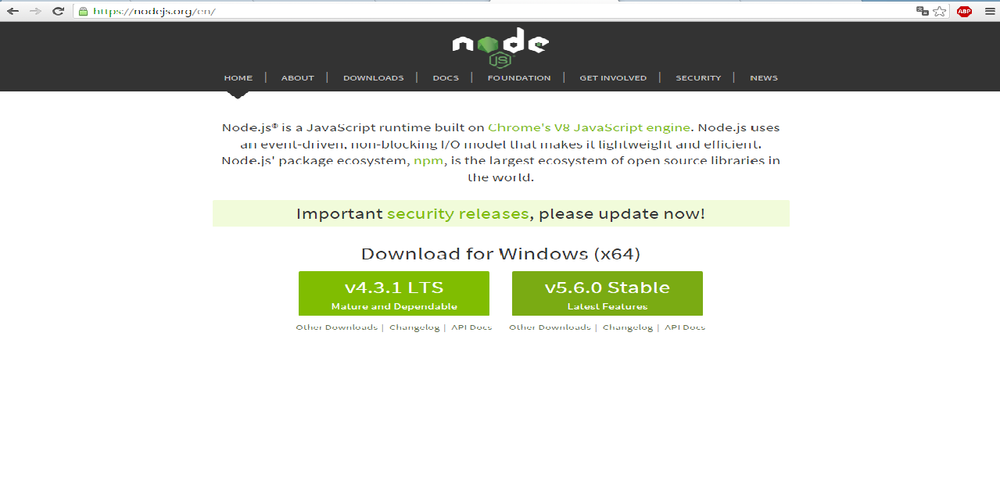
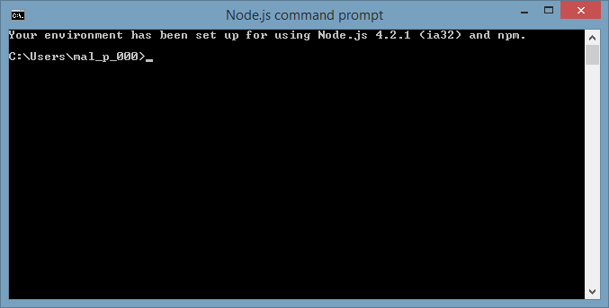
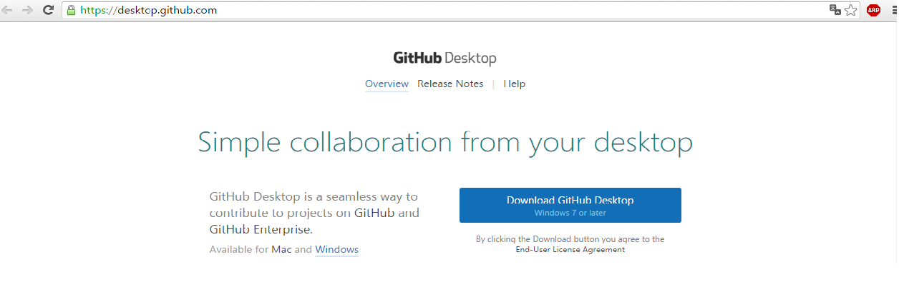
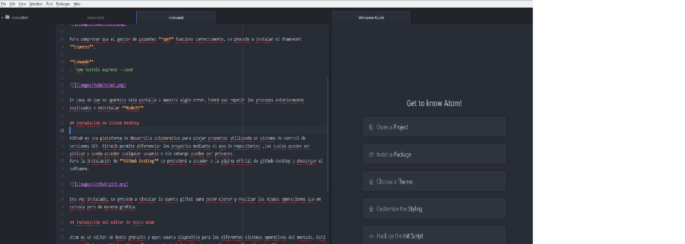
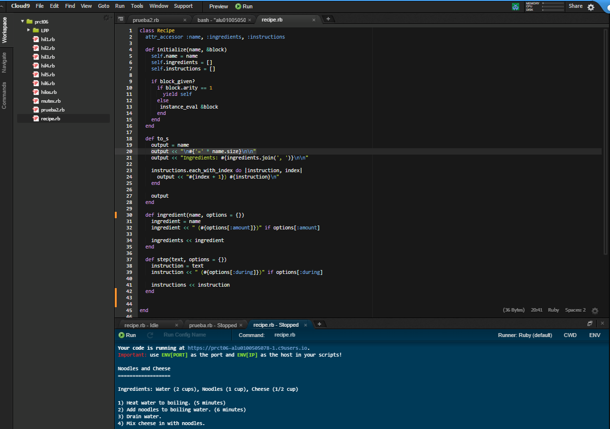
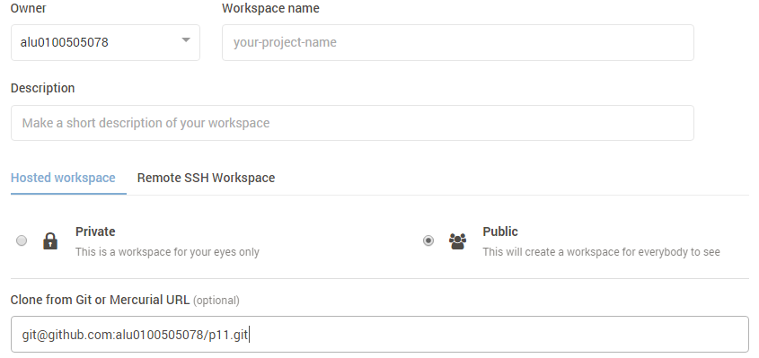
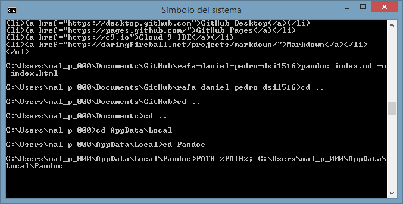
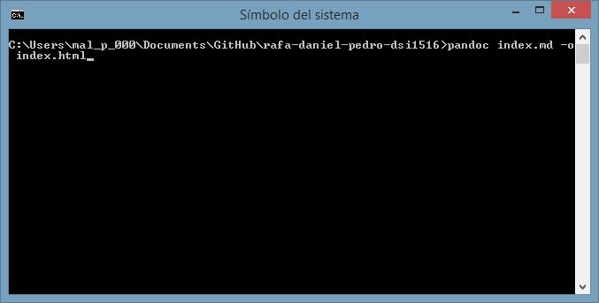

#Tutorial NodeJS, Express, Atom, GitHub, Cloud9 , Markdown y Pandoc

Este tutorial explica los pasos a seguir para instalar las diferentes herramientas que se usarán a lo largo de la asignatura "Desarrollo de Sistemas Informáticos" al igual que muestra capturas de pantallas del uso de las mismas herramientas.


## Instalación de NodeJS en Windows

Es un intérprete **Javascript** del lado del servidor que cambia la noción de cómo debería trabajar un servidor. Su meta es permitir a un programador construir aplicaciones altamente escalables y escribir código que maneje decenas de miles de conexiones simultáneas en una sólo una máquina física.

Para la instalación de NodeJS en windows, lo primero que debe hacer es visitar la página oficial y descargarlo.
En caso de poseer un sistema operativo basado en linux, la instalación será algo diferente. Si se posee una distribución  **Ubuntu** o **Debian** los comandos a ejecutar serías los siguientes:

**Comandos**
>` sudo apt-get update`
>` sudo apt-get install build-essential libssl-dev`
>` curl https://raw.githubusercontent.com/creationix/nvm/<span class="highlight">v0.7.0</span>/install.sh | sh`
>`source ~/.profile`
> `nvm install 0.10.31`



Una vez instalado en el  ordenador, se procederá a la ejecución de la consola. Al abrir la consola de **NodeJS**, deberá aparece una pantalla como la que se muestra a continuación.



Para comprobar que el gestor de paquetes **npm** funciona correctamente, se procede a instalar el framework **Express**.

**Comando**
> `npm install express --save`


En caso de que no aparezca esta pantalla o muestre algún error, habrá que repetir los procesos anteriormente explicados o reinstalar **NodeJS**

## Instalación de GitHub Desktop

Github es una plataforma de desarrollo colaborativo para alojar proyectos utilizando un sistema de control de versiones Git. Githuib permite diferenciar los proyectos mediante el uso de repositorios ,los cuales pueden ser público y pueda acceder cualquier usuario o sin embargo pueden ser privados.
Para la instalación de **Github Desktop** se procederá a acceder a la página oficial de github desktop y descargar el software.



Una vez instalado, se procede a vincular la cuenta github para poder clonar y realizar las mismas operaciones que en consola pero de manera gráfica.

## Instalación del editor de texto Atom

Atom es un editor de texto gratuito y open-source disponible para los diferentes sistemas operativos del mercado. Está desarrollado por github y tiene el soporte de instalar plug-ins para la personalización del editor.



Como en la asignatura se va a utilizar el formato **Markdown**, cabe destacar que **Atom** permite utilizar este formato y además, incorpora  la opción de obtener una previsualización del fichero **Markdown** creado. Para la previsualización del mismo, se utiliza  el comando que se muestra a continuación.

**Comando**

> * Markdown preview `ctrl+shift+m`
> * Markdown export to HTML `Save As HTML`

##Cloud9
**Cloud9** es un IDE online  que permite programar en gran cantidad de lenguajes de programación. Está desarrollado en el lenguajes de programación **Javascript** y para su uso es necesario crearse una cuenta oficial en la plataforma. Además, como posee una consola, es posible acceder a repositorios Github añadiendo primero la clave pública de C9 a nuestra cuenta oficial de **Github**.



Si se dispone de algún proyecto en un repositorio de GitHub se podrá  asociar a **Cloud9** para trabajar en él tan solo creando un “`nuevo workspace`” y añadiendo la url *git* del correspondiente repositorio.



Además **Cloud9** permite el trabajo en equipo en el IDE añadiendo miembros a tu workspace.

##Pandoc
**Pandoc** es una aplicación que permite convertir un archivo **Markdown** y lo convierte en formato **Latex**, **HTML**,**PDF** entre otros muchos más formatos. Para la instalación en windows hay que visitar la página oficial y descarga el archivo msi que se encuentra en la pestaña de descargas.
Para el posterior uso de Pandoc, se deben seguir una serie de pasos:
Primero  para poder utilizar el comando Pandoc en la consola, se debe realizar el comando que se muestra a continuación:



A continuación, se debe escribir en la dirección donde se encuentra el archivo.md que procederá a convertir en html el siguiente comando:



Y finalmente añadir la codificación utf-8 al archivo html para que se muestren bien las tildes y caracteres raros.


## Markdown

Markdown es un lenguaje de marcado ligero, es el lenguaje utilizado en el editor **Atom** ya que incorpora el formato y tiene la capacidad de mostrar una previsualización del mismo. Además, permite exportarlo a un archivo HTML sin la necesitad de realizar conversiones. La sintaxis utilizada en el lenguaje de marcado **Markdown** es la siguiente:

Encabezados
```
# Encabezado H1
## Encabezado H2
### Encabezado H3
```
Tipografía
```
**Negrita**
*Cursiva*
> Citas
Parrafo separar por lineas en blanco
`Codigo`
```
Recursos
```

* [Links](https://example.com)
```
Listas
```
1. Lista 1
2. Lista 2

* Lista 1
* Lista 2
```
**Donde encontrarme**
* [Google+](https://plus.google.com/u/0/111356122995885561622)
**Referencias**

 Para las definiciones de las herramientas usadas, se ha buscado la información en los siguientes referencias:

 * [NodeJS](https://www.ibm.com/developerworks/ssa/opensource/library/os-nodejs/)
 * [Nodejs Ubuntu,debian](https://carlosazaustre.es/blog/como-instalar-node-js-en-ubuntu/)
 * [Atom](https://en.wikipedia.org/wiki/Atom_(text_editor))
 * [C9](https://en.wikipedia.org/wiki/Cloud9_IDE)
 * [Markdown](https://es.wikipedia.org/wiki/Markdown)

**Recursos:**

* [NodeJS](https://nodejs.org)
* [Express](http://expressjs.com)
* [Atom IDE](https://atom.io)
* [GitHub Desktop](https://desktop.github.com)
* [GitHub Pages](https://pages.github.com/)
* [Cloud 9 IDE](https://c9.io)
* [Markdown](http://daringfireball.net/projects/markdown/)
* [Resultado FInal en HTML](https://alu0100505078.github.io/rafa-daniel-pedro-dsi1516/)
