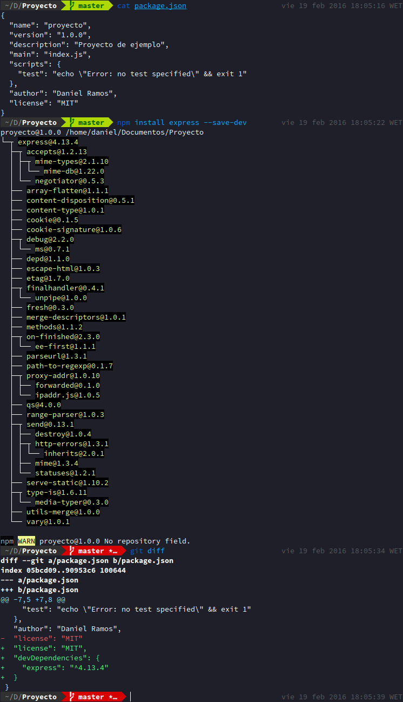

# Tutorial de las Tareas Iniciales

## Tabla de Contenido
1. [Instalar Git](#instalar-git)
2. [Instalar NodeJS](#instalar-nodejs)
3. [Instalar Express](#instalar-express)
  1. [Instalar el generador de Express](#instalar-el-generador-de-express)
  2. [Instalar Express en nuestro proyecto](#instalar-express-en-nuestro-proyecto)
4. [Instalar Atom](#instalar-atom)
5. [Cloud9 IDE](#cloud9-ide)
5. [Instalar Pandoc](#instalar-pandoc)

## Instalar Git
En Ubuntu, se puede instalar Git usando apt

    sudo apt-get install git

## Instalar NodeJS
> Node.js es un entorno en tiempo de ejecución multiplataforma, de código abierto, para la capa del servidor (pero no limitándose a ello) basado en el lenguaje de programación ECMAScript, asíncrono, con I/O de datos en una arquitectura orientada a eventos y basado en el motor V8 de Google.

Hay distintas formas de instalar Node, una de ellas (y posiblemente la más sencilla), es mediante el script [nvm](https://github.com/creationix/nvm). El problema de este script es que es específico de Bash, por lo que si usamos un intéprete distinto (como en mi caso que uso [fish](https://github.com/fish-shell/fish-shell) no nos funcionará o tendremos problemas.

Es por esta razón que al final he decidido descargar el código fuente y compilarlo e instalarlo. A continuación enumero los pasos que he seguido.

1. Descargar el código fuente desde la [página de descargas de Node](https://nodejs.org/en/download/)

        wget https://nodejs.org/dist/v5.6.0/node-v5.6.0.tar.gz

2. Descomprimir el fichero

        tar xzvf node-v5.6.0.tar.gz

3. Entramos al directorio, ejecutamos el script de configuración, compilamos e instalamos.

        cd node-v5.6.0
        ./configure
        make
        sudo make install

4. Al haberlo instalado como superusuario, si deseamos instalar un paquete con npm no podremos ya que el directorio pertenece al usuario root, así que cambiamos e propietario de los directorios a nuestro usuario

        sudo chown -R $(whoami) $(npm config get prefix)/{lib/node_modues,bin,share}

5. Una ver arreglado, ya podemos comenzar a usar node y npm.

        node --version
        v5.6.0
        npm --version
        3.6.0

Captura de pantalla con node y npm instalados:

## Instalar Express
> Express.js es un framwork para servidores Node.js, diseñado para construir aplicaciones de una página, multiágina, e híbridas.

Express como tal no se puede instalar, lo que se debe hacer es instalarlo como dependencia de nuestro proyecto. Lo que sí podemos instalar de manera global es el generador de Express, que nos sirve para generar un esqueleto que nos sirve como base para poder desarrollar nuestro proyecto.

### Instalar el generador de Express

Instalar el generador sólo requiere de un único comando.

    npm install -g express-generator

En este punto ya tendremos el generador instalado, por lo que si queremos generar un nuevo proyecto, lo hacemos con el siguiente comando:

    express mi-app

### Instalar Express en nuestro proyecto
Instalar express con npm es muy sencillo, sólo tenemos que acceder al directorio de nuestro proyecto y ejecutar el siguiente comando:

    npm install express --save-dev

El parámetro `--save-dev` añade Express como dependencia del proyecto en el fichero `package.json`, así que si alguien clona nuestro proyecto, al hacer `npm install` express también se instalará.

## Instalar Atom
> Atom es un editor de texto de código abierto para OS X, Linux y WIndows con soporte para plugins escritos en Node.js, con un control de Git embebido y desarrollado por Github.

Mi distribución es Ubuntu, así que sólo hay que descargar el paquete (.deb) desde la [página de Atom](https://atom.io/) e instalarlo con el administrador de paquetes de Ubuntu.

## Cloud9 IDE
> Cloud9 IDE es un software gratuito online integrado con un entorno de desarrollo. Sporta distintos lenguajes de prgramaión, como PHP, Ruby, Perl, Python, Javascript con Node.js y Go.

## Instalar Pandoc
> Pandoc es una herramienta gratuita y de código abierto que nos permite convertir un lenguaje de marcas (Como Markdown o LaTeX) a otro.

Accedemos al los [releases](https://github.com/jgm/pandoc/releases) del proyecto de github, y descargamos el último paquete .deb y lo instalamos.

    pandoc --version
    pandoc 1.16.0.2
    Compiled with texmath 0.8.4.1, highlighting-kate 0.6.1.
    [...]

Ahora, sólo nos queda generar el fichero HTML con el siguiente comando:

    pandoc -s -o index.html